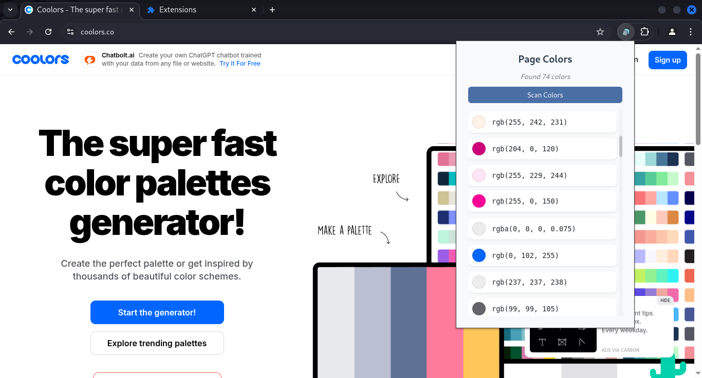

# Color Lister Chrome Extension

 

A Chrome extension that detects and displays all colors used in the current webpage.

## Installation

1. Clone this repository 
2. Open Chrome and navigate to: `chrome://extensions/`
3. Enable Developer mode
4. Click "Load unpacked"
5. Select the extension folder

## How to Use

1. Navigate to any webpage
2. Click the extension icon in your toolbar
3. Click "Scan Colors" in the popup
4. Enjoy it!